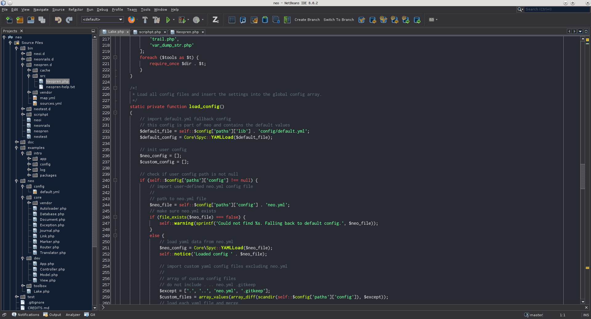
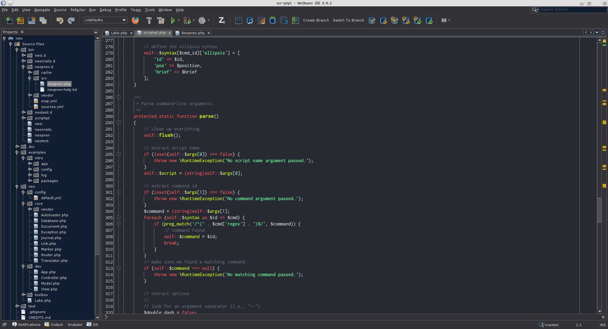
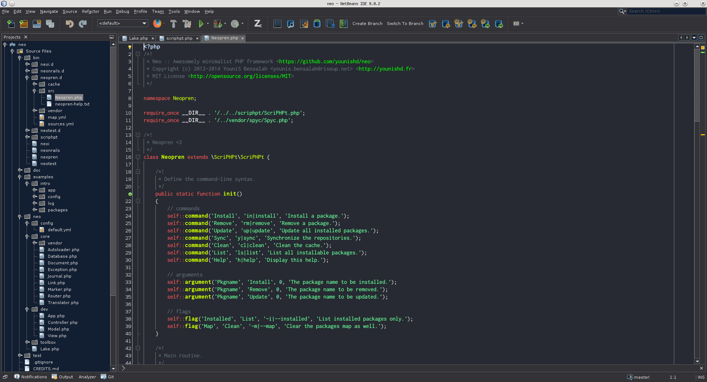
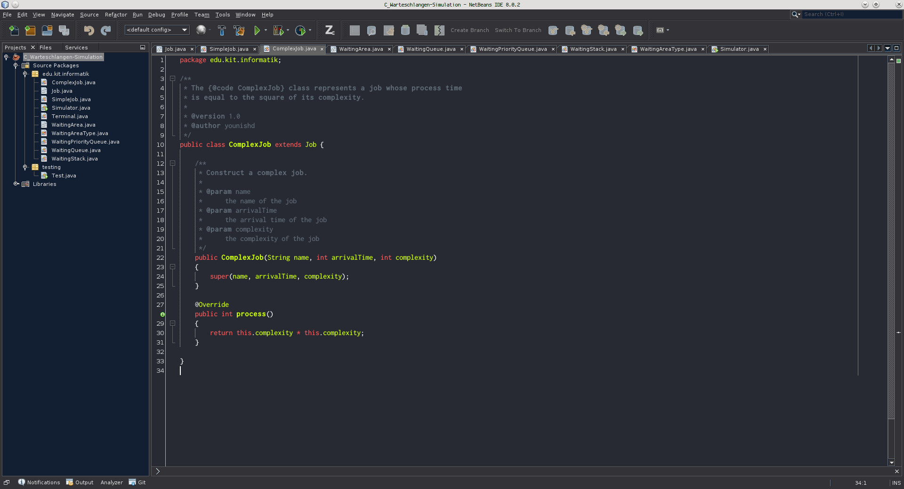
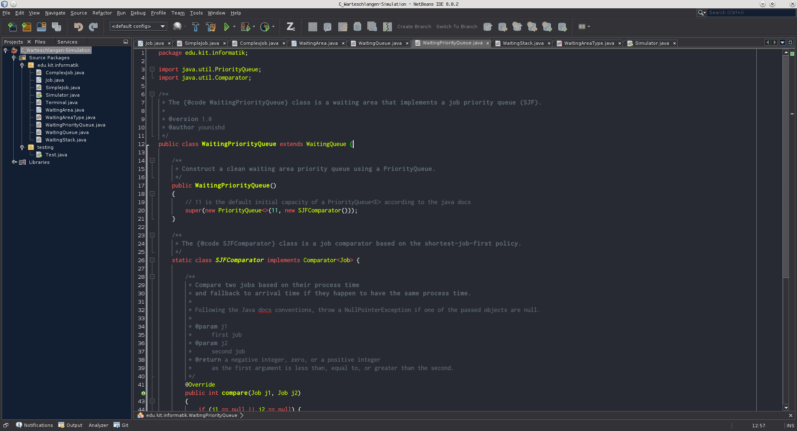

# NightlyBeans

A dark _NetBeans_ color scheme that doesn't kill your eyes.

## Anomalies

Just report anything that looks weird. Also note that I'm mainly using this scheme for _PHP_ and _Java_ code.

## Protip

I'm using the [_Inconsolata dz_](http://nodnod.net/2009/feb/12/adding-straight-single-and-double-quotes-inconsola) font and the _Dark Metal_ look and feel.

## Credits

Designed by [YouniS Bensalah](http://younishd.fr).

## License

[MIT](LICENSE)
